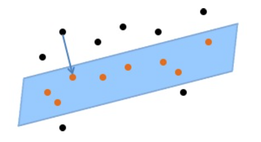
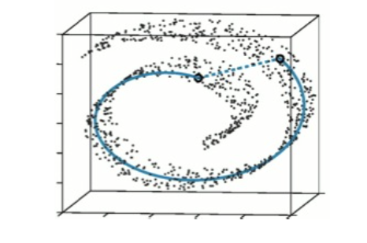

## Introduction

* Difference between algorithms and machine learning: **the input-output mapping cannot easily be made precise**.
* 4 types of output space: ** discrete, continuous, probability values, more general structures **.

## Categorization of machine learning
* Discrete output space: **classification**
    * binary classification
    * multiclass classification
* Continuous output space **regression**
* Conditional probability functions
* Structured output spaces

## Course outline
* Nonparametric methods: unbounded in size, arbitrarily complext functions
    * **nearest neighbor**: distance function? Speed up?
    * **decision tree**
* Classification with *parametrized* models
    * Generative: model individual classes, find the most probable class
    * Discriminative: model the decision boundary, figure which side of the boundary it lies on
* Combining classifiers
    * complex classifiers require a lot of training data
    * simple classifiers require less
    * richer classifiers via kernel trick: non-linear boundary, data is not vectors
    * richer output spaces: output space is larger than binary case
    * composing simple classifiers: a linear combination if weak classifiers, generically improve performance of any kind of classifier
* Representation learning
    * Dimensionality reduction and denoising (project to a low-dimensional linear subspace)
    
    * Embedding and manifold learning(Data lie in a non-Euclidean space)
    
    * Metric learning
    Data is only vague positional information, impose an euclidean geometry that is suitable for classification.
* Deep learning
    * NLP, speech, vision

## supplemental materials form textbook 
* Supervised vs. unsupervised learning: we have *vs.* haven't outcome measurement (quantitatively or categorically) based on a set of features.